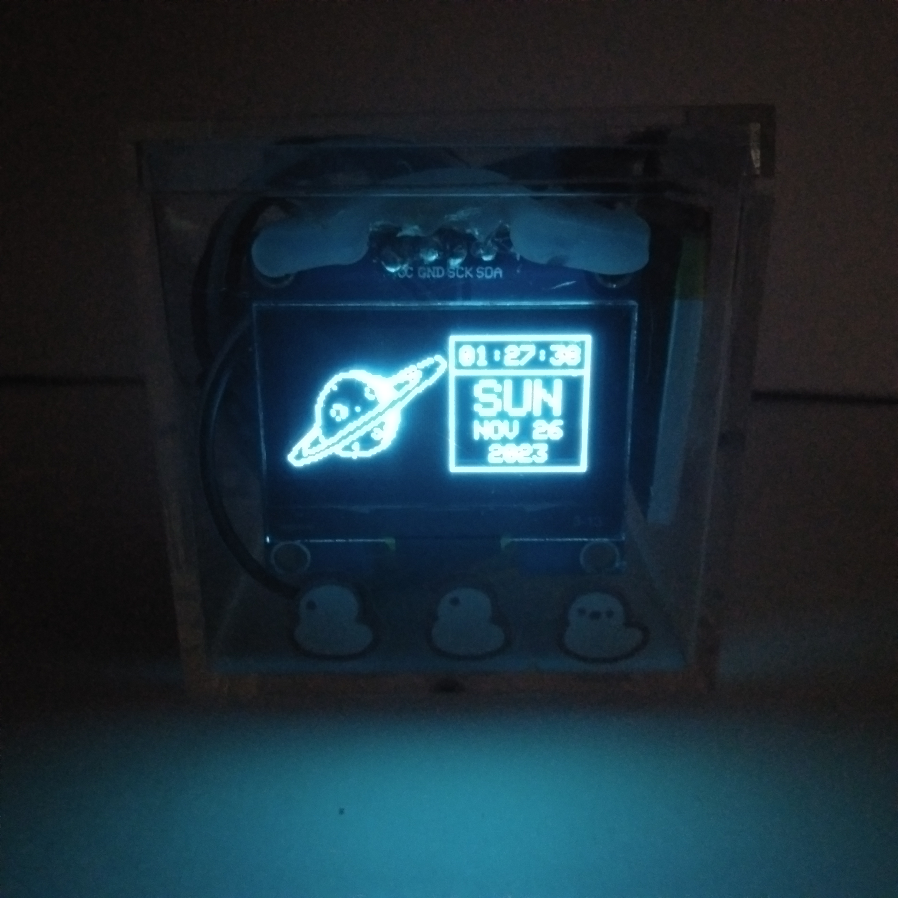
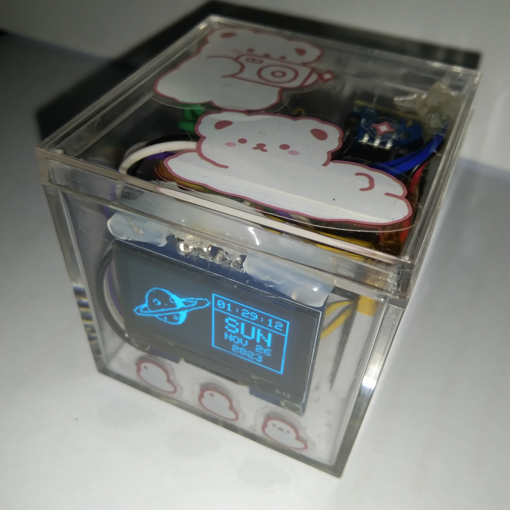

# 🚀 Astroclock

Astroclock is a cute desktop date and time display powered by an Arduino Nano and a monochromatic SH1106 OLED display. The clock utilizes a DS1307 real-time clock for accurate timekeeping. Housed in a stylish cubic acrylic box with a length of 5.5cm, Astroclock adds a touch of space-themed aesthetics to your desk.

|  |  |
|-----------------------------------|------------------------------------|

## 🪐 Features

- **Real-Time Clock**: Astroclock employs a DS1307 RTC module for precise timekeeping, ensuring accurate date and time display.
- **Monochromatic Display**: The SH1106 OLED display provides a clear and crisp monochromatic output, enhancing readability.
- **Random Space-Themed Bitmaps**: Enjoy a touch of outer space with randomly generated space-related bitmaps on the left side of the display.
- **Compact Design**: Housed in a cubic acrylic box measuring 5.5cm in length, Astroclock is a compact and visually appealing desktop accessory.

## 🔭 Requirements

1. **Arduino Nano**:

    The brain of the Astroclock, responsible for running the code and controlling the connected modules. Ensure you have a compatible Arduino Nano board.

2. **SH1106 OLED Display**:

    A 1.3" inch monochromatic OLED display that serves as the visual output for Astroclock. Connect this display to the Arduino Nano following the provided schematic.

3. **DS1307 Real-Time Clock (RTC) Module**:

    The DS1307 RTC module is crucial for accurate timekeeping in Astroclock. It keeps track of the date and time even when the main power is off. Wire it to the Arduino Nano as per the schematic.

4. **Acrylic Box (5.5cm Length)**:

    The compact and stylish cubic acrylic box serves as the housing for Astroclock. Ensure it has dimensions of 5.5cm in length to accommodate the components comfortably.

5. **Jumper Wire Connectors**:

    Use appropriate wires and connectors to establish connections between the Arduino Nano, SH1106 OLED display, and DS1307 RTC module. Refer to the schematic for correct wiring.

6. **Power Supply**:

    Provide a suitable power supply for the Arduino Nano. This could be a 3.7V LiPo connected to 5V and GND pins respectively to the Arduino Nano.

## 🛰 Setup and Configuration

Connect the Arduino Nano to the SH1106 OLED display and DS1307 RTC module. Both SH1106 OLED and DS1307 are assumed to be I2C modules, which is always the case.

1. Upload the provided Arduino sketch (astroclock.ino) to the Arduino Nano.
2. Place the Arduino Nano, SH1106 OLED display, and DS1307 RTC module inside the acrylic box.
3. Power on Astroclock, and enjoy the delightful display of date, time, and space-themed bitmaps.

## 🧑‍🚀 License

```
Copyright 2023 - Nathanne Isip

Permission is hereby granted, free of charge, to any person
obtaining a copy of this software and associated documentation
files (the “Software”), to deal in the Software without restriction,
including without limitation the rights to use, copy, modify,
merge, publish, distribute, sublicense, and/or sell copies of
the Software, and to permit persons to whom the Software is
furnished to do so, subject to the following conditions:

The above copyright notice and this permission notice shall be
included in all copies or substantial portions of the Software.

THE SOFTWARE IS PROVIDED “AS IS”, WITHOUT WARRANTY OF ANY KIND,
EXPRESS OR IMPLIED, INCLUDING BUT NOT LIMITED TO THE WARRANTIES
OF MERCHANTABILITY, FITNESS FOR A PARTICULAR PURPOSE AND
NONINFRINGEMENT. IN NO EVENT SHALL THE AUTHORS OR COPYRIGHT
HOLDERS BE LIABLE FOR ANY CLAIM, DAMAGES OR OTHER LIABILITY,
WHETHER IN AN ACTION OF CONTRACT, TORT OR OTHERWISE, ARISING
FROM, OUT OF OR IN CONNECTION WITH THE SOFTWARE OR THE USE OR
OTHER DEALINGS IN THE SOFTWARE.
```